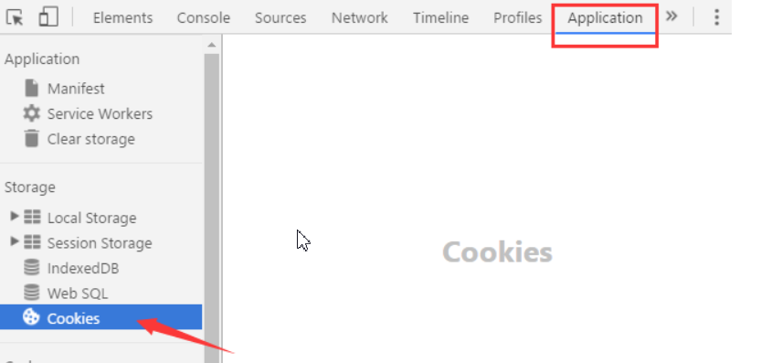

## 第一节：

#### **协议：**

> 协议，就是事先的一种约定、规则、规范、标准。说白了，就是咱俩说话用普通话还是家乡话，用英语还是法语，唱着说还是好好说，咱们提前规定好。这就是通信协议

#### 常见协议

- HTTP、HTTPS 超文本传输协议 
- FTP 文件传输协议（上传文件）
- SMTP 简单邮件传输协议

### TCP协议[了解]

    TCP/IP协议栈分为四层，每一层都由特定的协议与对方进行通信，而协议之间的通信最终都要转化为 0 和 1 的电信号，通过物理介质进行传输才能到达对方的电脑，因此物理介质是网络通信的基石。


#### 三次握手示意图

1、建立连接    2、传输数据   3、断开连接


第一次握手
+ 客户端发了个连接请求消息到服务端
+ 服务端收到信息后知道自己与客户端是可以连接成功的，但此时客户端并不知道服务端是否已经接收到了它的请求，所以服务端接收到消息后得应答，

第二次握手

+ 客户端得到服务端的反馈后，才确定自己与服务端是可以连接上的，这就是第二次握手
+ 两次握手已经建立连接，为什么还需要第三个握手呢？
+ 例如：客户端发出去的第一个连接请求由于某些原因在网络节点中滞留了导致延迟，直到连接释放的某个时间点才到达服务端，这是一个早已失效的报文，但是此时服务端仍然认为这是客户端的建立连接请求第一次握手，于是服务端回应了客户端，第二次握手。

第三次握手

- 如果只有两次握手，那么到这里，连接就建立了，但是此时客户端并没有任何数据要发送，而服务端还在傻傻的等候佳音，造成很大的资源浪费。所以需要第三次握手，只有客户端再次回应一下，就可以避免这种情况。

- 所以说，第三次握手是为了防止已经失效的连接请求报文段突然又传到服务端，因而产生错误。

  

### **HTTP协议**[了解]

HTTP协议即超文本传输协议,  是一个 [浏览器端] 和 [服务器端] 请求和响应的标准

- 常用请求方法  GET, POST

- 请求 (request)：请求行、请求头、请求主体。

- 响应 (response)：状态行、响应头、响应主体。

  

#### **HTTP的请求协议**[看一看]

```js
HTTP请求由状态行、请求头、请求正文三部分组成：

状态行：包括请求方式Method、资源路径URL、协议版本Version；

请求头：包括一些访问的域名、用户代理、Cookie等信息；

请求正文：就是HTTP请求的数据。
```


#### HTTP协议特点：无状态的,  多次请求之间没有相关性

[即同一用户请求同一网站的不同页面，服务器无法识别是否是同一用户发起的请求。因此，用户无法进行连续的业务逻辑.如：登录，已在A页面登录，请求B页面，提示未登录。]


##### cookie的特点[掌握]

- cookie中的数据 可以被同一个网站的页面所共享
- `不同浏览器`的cookie `不能共享`
- cookie的数据`存储在浏览器`中，每次请求服务器，在请求报文中携带cookie的数据，发送给服务器
- `服务器端无法直接操作cookie，是通过在服务器端设置响应头的的方式，通知浏览器对cookie进行设置`--`故cookie必须在服务器的环境下使用`
- cookie中的数据有效期，不设置是`会话级别`的, `浏览器关闭，会话结束，数据销毁,可以人为设置cookie的有效期`
- cookie`存储容量小，约4kb`
- cookie要求存储的数据必须是`字符串格式`
##### cookie的查看

浏览器中对cookie的查看



例:获取百度中的cookie

```
   document.cookie
    打开百度，在控制面板中输入alert(document.cookie);就会弹出百度的cookie。如下：
```


#### js操作cookie

`一定通过服务器的方式就行访问`

##### **基本使用**

语法格式

```javascript
设置cookie:
document.cookie="username=John;expires=过期时间; path=/";
                     存储的值      有效时间      适用范围
 注意:此处的有效期是时间字符串.
 
读取cookie
document.cookie

删除cookie
直接设置时间过期

encodeURIComponent对中文进行转码

decodeURIComponent对中文解析解码

toUTCString()方法转成了标准时区，转成了系统时间

```

例1:通过cookie存储name,age,addr数据

```
// 1. 设置, 要求 键值对, 通过 = 分隔
  document.cookie = "name=mm";
  document.cookie = "age=18";
  document.cookie = "desc=shuai";  
  
//2. 获取, document.cookie 一次性将所有的 cookie 都获取, 以字符串的形式返回

//通过 "; " 分隔, name=pengpeng; age=18; desc=shuai
   console.log( document.cookie );

// 获取cookie中的值 
   document.cookie;

问题:一次性存储多个cookie后,没办法直接获取指定的
```


### 例子

[一周内免登录+跳转]

商品浏览记录

#### 总结:

协议: 就是互联网遵守的一系列规则.

常见协议: http https  ftp smtp

tcp协议: 通信和传输数据使用的协议

http:请求和响应时遵守的协议

 方法 get/post

特点:前一次请求和后一次请求没有关联.

cookie:将网站需要保存的数据保存到浏览器中

特点:一个网站不同页面可以共享,不同网站不能共享.

cookie的存储  document.cookie = 'key=value;expires=time'


### 第三节

##### **cookie的封装:**


##### json与Cookie

回顾

```
json的值只能是数组或对象，不能是函数、正则表达式对象、日期对象。
字符串必须使用双引号表示，不能使用单引号。
对象的键名必须放在双引号里面。
```

```
JSON.stringify方法用于将一个值转为 JSON 字符串。
JSON.stringify([1,2,3]);
JSON.stringify({ name: "张三" })// '{"name":"张三"}'

JSON.parse方法用于将 JSON 字符串转换成对应的值。
var o = JSON.parse('{"name": "张三"}');
```

**引用**

我们可以把js中的对象，转为字符串，存贮在cookie中，从而来存贮复杂的数据

```
var userObj = {name:"张三",age:18}
var jsonStr = JSON.stringify(userobj);
setCookie('userinfo',jsonStr,7)//把用户的信息存储在cookie中
var arr = [
{name:"张1",age:18},
{name:"张2",age:18},
{name:"张3",age:18}
]
var jsonStr = JSON.stringify(arr);
setCookie('users',jsonStr,7)//把多个账户息存储在cookie中
```

##### 购物车的应用


### 强化练习

掌握cookie跟json的配合

### Cookie缺点

- cookie可能被禁用；
- cookie与浏览器相关，不能互相访问；
- cookie可能被用户删除；
- cookie安全性不够高；
- cookie存储空间很小(只有4–10KB左右)

 
