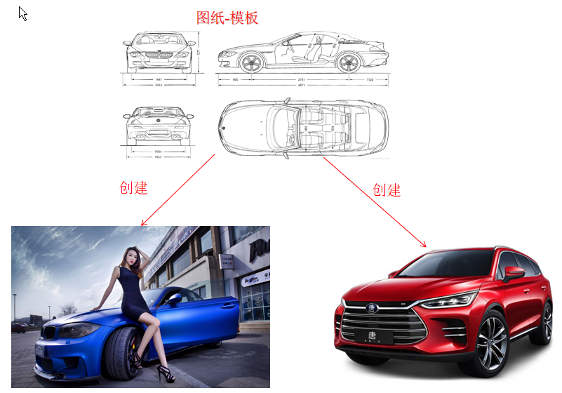

<h3 align="center">面向对象</h3>
------

#### 一、面向对象


#### 1、概念

面向对象（Object Oriented，OO）是软件开发方法。面向对象的概念和应用已超越了程序设计和软件开发，扩展到如数据库系统，交互式界面，应用结构，应用平台，分布式系统，网络管理结构，CAD技术，人工智能等领域。面向对象是一种对现实世界理解和抽象的方法，是计算机编程技术发展到一定阶段后到产物，是一种高级的编程思想。


#### 2、面向对象和面向过程区别

**面向过程**

- 强调的是功能行为

- 关注的是解决问题需要哪些步骤

  

回想下前面我们完成一个需求的步骤：

- 首先搞清楚我们要做什么
- 然后分析怎么做
- 最后我用代码体现
- 一步一步去实现，而具体的每一步都需要我们去实现和操作

- 在上面每一个具体步骤中我们都是参与者， 并且需要面对具体的每一个步骤和过程， 这就是面向过程最直接的体现

  

**而我们要学习的面向对象是基于面向过程而言的**


**面向对象**

- 将功能封装进对象，强调具备了功能的对象
- 关注的是解决问题需要哪些对象

当需求单一， 或者简单时， 我们一步一步去操作没问题， 并且效率也挺高。 可随着需求的更改， 功能的增加， 发现需要面对每一个步骤非常麻烦， 这时就开始思索， 能不能把这些步骤和功能再进行封装， 封装时根据不同的功能，进行不同的封装，功能类似的封装在一起。这样结构就清晰多了， 用的时候， 找到对应的类就可以了， 这就是面向对象思想


**通过现实的例子来具体了解**

```
比如：吃饭、洗衣服、买电脑
```


#### 二、面向对象的特点

专业解释：

```js
封装：不考虑内部实现，只考虑功能实现

把一些比较散的，单一的值，有结构的组装成一个整体。把一些隐藏的值不暴露给外界


继承：从已有对象上，继承出新对象

获取已存在的对象已有属性和和方式的一种方式


多态：一个父类的引用变量，可以指向其任意一个子类对象

简单来说就是同一操作，作用于不同的对象，会产生不同的解释和行为
```

理解解释：

- 是一种符合人们思考习惯的思想
- 可以将复杂的事情简单化
- 将程序员从执行者转换成了指挥者
- 完成需求时：
  - 先要去找具有所需的功能的对象来用
  - 如果该对象不存在，那么创建一个具有所需功能的对象
  - 这样简化开发并提高复用


#### 三、类与对象的关系

面向对象的核心就是对象,那怎么创建对象?

```
现实生活中可以根据模板创建对象,编程语言也一样,也必须先有一个模板,在这个模板中说清楚将来创建出来的对象有哪些属性和行为。
```

##### 理解类：

比如人类，指的是一个范围； 对象：比如某个人，指的是这个范围中具体的对象




- JavaScript中的类相当于图纸，用来描述一类事物。
- JavaScript中可以自定义类, 但是也提供了一个默认的类叫做Object


#### 四、创建对象的方式

1、通过 new Object() 创建对象

```js
//使用默认类创建一个空对象
var obj = new Object();
//给对象设置属性
obj.name = "小明";
obj.age = 18;
//给对象设置方法
obj.say = function(){
    console.log("我要去跑步了");
}
//使用对象属性和方法
console.log(obj.name);
console.log(obj.age);
obj.say();
```


2、通过字面量创建对象

```js
//字面量方式
var obj = {
    //给对象设置属性
    name : "小明",
    age : 18,
    //给对象设置方法
    say : function(){
        console.log("我要去跑步了");
    }
}
//使用对象属性和方法
console.log(obj.name);
console.log(obj.age);
obj.say();
```


2、使用工厂函数创建对象

- 上面的创建方式, 每创建一个人都需要将代码再写一遍, 冗余代码太多, 所以我们可以创建创建对象的代码封装到一个函数中
- 专门用于创建对象的函数我们称之为工厂函数

第一种形式：

```js
function person(name, age){
    //创建一个空对象
    var obj = new Object();
    //设置属性
    obj.name = name;
    obj.age = age;
    //设置方法
    obj.say = function(){
        console.log("hello");
    }
    //把对象返回出去给外界
    return obj;
}
var p1 = person("小明", 18);
var p2 = person("小刚", 20);
console.log(p1, p2);
```

第二种形式

```js
function person(name, age){
    var obj = {
        name : name,
        age : age,
        say : function(){
            console.log("hello");
        }
    }
    return obj;
}
var p1 = person("小明", 18);
var p2 = person("小刚", 20);
console.log(p1, p2);
```


3、函数中的this关键字

**每个函数中都有一个this关键字, 谁调用当前函数, this关键字就是谁**

a、默认情况下直接调用的函数都是由window调用的

```js
function fn(){
	console.log(this);//window
}
fn();
```


b、如果函数作为对象的方法，由对象来调用函数，这个时候函数里面的this就是对象本身

```js
var obj = {
    name : "张三",
    age : 18,
    say : function(){
    	console.log(this); //指的是obj对象本身
    }
}
obj.say();
```


#### 五、构造函数

1、什么是构造函数？构造函数和工厂函数是一样的，都是专门用来创建对象的

构造函数本质上来说是工厂函数的简写


2、构造函数和工厂函数的区别？

构造函数的函数名称必须首字母大写

构造函数只能通过new关键字来调用

```js
//构造函数
function Person(name, age){
    this.name = name;
    this.age = age;
    this.say = function(){
    console.log("hello");
	}
}
//实例化
var p1 = new Person("小明", 18);
var p2 = new Person("熊大", 20);
console.log(p1, p2);
```


3、使用构造函数系统自动帮我们做了什么？

当我们new Person("小明", 18)，系统帮我们做了什么事？

​			会在构造函数中自动创建一个对象
​			将自动创建的对象赋值给this
​			会在构造函数的最后自动添加return this

```js
function Person(name, age){
    //var obj = new Object(); 系统自动添加
    //this = obj;  系统自动添加
    this.name = name;
    this.age = age;
    this.say = function(){
        console.log("hello");
    }
    //return this; 系统自动添加
}
var p1 = new Person("小明", 18);
var p2 = new Person("熊大", 20);
console.log(p1, p2);
```


##### 构造函数优化

内存优化  --- new出的对象都是使用的构造函数中的方法，但是存储不一样，所以会有性能问题

prototype属性 是函数默认规定。存储在prototype中的方法和属性可以被对应的构造函数创建出来的所有对象共享

查找规则：先查找自己构造函数中，再去找prototype中的


#### 六、prototype属性

- JavaScript 规定，每一个构造函数都有一个 prototype 属性，指向另一个对象。
- 这个对象的所有属性和方法，都会被构造函数的所拥有
- 也就意味着，我们可以把所有对象实例需要共享的属性和方法直接定义在 prototype 对象上

```js
function Person(name, age){
    this.name = name;
    this.age = age;
    // this.say = function(){
    // 	console.log("hello");
    // }
}
//通过原型添加 最专业写法
Person.prototype = {
    say : function(){
        console.log("hello");
    }
}
var p1 = new Person("小明", 18);
var p2 = new Person("小刚", 20);
console.log(p1.say === p2.say); //true
```


#### 七、对象的三角恋关系

- 每个**构造函数**中都有一个默认的属性，叫做prototype。prototype属性保存着一个对象，这个对象我们称之为“**原型对象**”
- 每个"**原型对象**"中都有一个默认的属性，叫做constructor。这个constructor指向当前原型对象对应的构造函数
- 通过构造函数创建出来的对象我们称之为“**实例对象**”。每个实例对象都有一个默认的属性，叫做`_proto_`
- `__proto__`指向创建它的那个构造函数的**原型对象**


#### 八、函数和对象

- JavaScript中的函数是引用类型（对象类型），既然是对象，所以也是通过构造函数创建出来的， “所有函数”都是通过Function构造函数创建出来的对象
- JavaScript中只要是"函数"，就有prototype属性。Function函数的prototype属性指向**Function原型对象**
- JavaScript中只要有**原型对象**就有**constructor**属性。**Function原型对象**的**constructor**指向它对应的构造函数

- JavaScript中万物皆对象，只要是对象就有`__proto__`属性


#### 九、原型链

- 先查找当前对象, 当前对象有就使用当前对象的方法
- 当前对象没有再逐层在原型链上查找, 最先找到那个就使用哪个
- 如果找到null都没找到就报错


#### 十、ES6定义类

从ES6开始系统提供了一个名称叫做class的关键字，这个关键字就是专门用于定义类的

```js
class Person{
    //当我们通过new创建对象的时候,系统会自动调用constructor
    constructor(name, age) {
        this.name = name;
        this.age = age;
	}
    say(){
    console.log("hello");
	}
}
var p1 = new Person("小明", 18);
var p2 = new Person("小红", 22);
console.log(p1, p2);
console.log(p1.say());
console.log(p1.say === p2.say);//true
```


#### 十一、OOA和OOD

```
OOA面向对象分析：
人类起源：单细胞－－－－人，进化过程中，增加了各种器官，各个器官之间分工协作
为什么统治世界的是人类？－－－－－精密的分工协作


大规模分工，精密协作

面向对象分析：将大问题拆分成小问题，并试图用分工协作来完成的思维方式。


OOD面向对象设计：
1.分析模块后，确定职责

大哥招小弟－－端茶倒水，点烟捶背捏脚


2.确定耦合关系
确定通信关系，如何交流，暗号
弊端：当耦合达到一定程度时，如果换了一个助理，需要重新耦合，资源消耗太大


高内聚低耦合


3.为OOD做准备

分析角色特性：
讲师－－－－技术过硬
－－－－讲课技能（口才）

销售－－－－沟通技巧（口才）

找到角色共同特性－－－－继承


对象如何被发明的？

大量信息的处理和加工困难，打包之后，将内容包含在其中。信息传递速度更快，效率更高

面向对象和面向过程的区别
面向对象－－先实现功能，再运行。分工协作，同时发生，解决问题。

面向过程－－一边实现，一边运行。效率低下。

面向对象并不是程序员发明的。在程序中我们叫面向对象（OO），在生活中叫分工协作。

思考 > 语法
```

#### 十二、构造函数和对象的关系

```
面向对象－－－－对一个对象进行编程

构造函数－－－－提供一个对象供你编程

通过构造函数，实现面向对象编程
```
